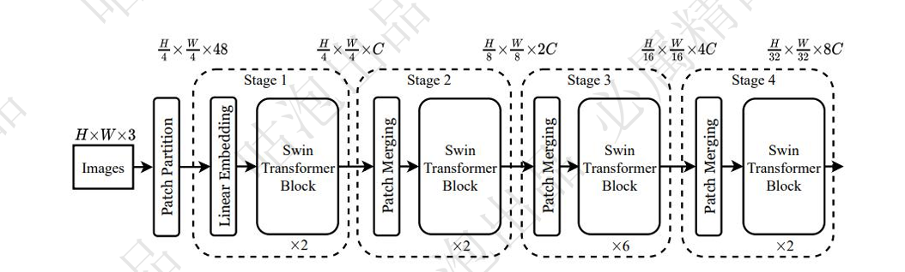

# Swin Transformer算法原理解析

## 1. Swin Transformer概述

### 1.1 基本介绍

Swin Transformer是一种新型的视觉backbone网络，在分类、分割、检测等多种计算机视觉任务中均表现出色，被誉为"刷分神器"。其名称"Swin"代表"**S**hifted **Win**dow"，即移动窗口，这也是该模型的核心创新点之一。

### 1.2 解决的核心问题

Swin Transformer主要解决了以下几个问题：

1. **长序列问题**：图像中像素点数量庞大，如果需要提取更多特征就必须构建很长的序列。

2. **计算效率问题**：序列越长，计算注意力机制的效率就越低，导致计算资源消耗大。

3. **感受野问题**：如何在Transformer架构中体现CNN中常提到的感受野概念。

Swin Transformer的本质是通过窗口和分层的形式来替代传统Transformer处理长序列的方法，从而提高计算效率并扩大感受野。

## 2. 整体网络架构

Swin Transformer的整体架构包含两个主要步骤：

1. 获取各Patch特征构建序列
2. 分层计算attention（逐步下采样过程）

其中，Block是整个架构中最核心的部分，它对attention的计算方法进行了创新性改进。



### 2.1 网络结构详解

网络结构中包含多个Stage，每个Stage的特征图尺寸和通道数如下所示：

- Stage 1: H/4 × W/4 × 48
- Stage 2: H/8 × W/8 × C
- Stage 3: H/16 × W/16 × 2C
- Stage 4: H/32 × W/32 × 4C

其中H和W是输入图像的高度和宽度，C是基础通道数。

每个Stage包含：
- Patch Partition/Merging：负责特征下采样
- Linear Embedding：线性嵌入层
- Swin Transformer Block：核心计算单元，每个Stage包含多个Block

## 3. Transformer Blocks

Swin Transformer中的Block是由两个关键组件组成的组合：

1. **W-MSA**（Window Multi-head Self Attention）：基于窗口的多头自注意力计算
2. **SW-MSA**（Shifted Window Multi-head Self Attention）：窗口滑动后重新计算的多头自注意力

这两个组件串联在一起构成了一个完整的Block，是Swin Transformer的核心计算模块。

Block的结构如下：


其中LN表示Layer Normalization，MLP是多层感知机。

## 4. Patch Embedding

Patch Embedding是将输入图像转换为序列的过程：

- **输入**：图像数据，尺寸为(224, 224, 3)
- **输出**：特征序列，尺寸为(3136, 96)，相当于序列长度为3136个，每个的向量是96维特征
- **实现方式**：通过卷积实现，使用Conv2d(3, 96, kernel_size=(4, 4), stride=(4, 4))
- **计算过程**：3136 = (224/4) × (224/4)，即将图像划分为4×4的patch，总共有56×56个patch

这一步的目的是将图像数据转换为可被Transformer处理的序列形式。

## 5. Window Partition

Window Partition是将特征图划分为多个窗口的过程：

- **输入**：特征图，尺寸为(56, 56, 96)
- **默认窗口大小**：7×7
- **窗口数量**：8×8=64个窗口（56÷7=8）
- **输出**：特征图，尺寸为(64, 7, 7, 96)

这一步将处理单位从序列转变为单位窗口，共有64个窗口，每个窗口包含7×7=49个patch。

## 6. W-MSA（Window Multi-head Self Attention）

W-MSA对每个窗口内的patch计算自注意力：

- **处理对象**：每个窗口内的patch
- **QKV矩阵**：(3, 64, 3, 49, 32)
  - 3个矩阵(Q,K,V)
  - 64个窗口
  - heads为3
  - 窗口大小7×7=49
  - 每个head特征维度96/3=32
- **Attention结果**：(64, 3, 49, 49)，表示每个头都会计算出每个窗口内的自注意力矩阵

W-MSA的计算仅限于窗口内部，不同窗口之间的patch不会相互影响。

1️⃣ Patch embedding 被划分为多个窗口

每个窗口形状为：(49, 96)

这表示每个窗口中有 49 个 patch，每个 patch 是 96 维的向量。

------

2️⃣ 构建 Q, K, V

使用一个线性变换将 `(49, 96)` 映射成：(49, 3, 32)  ⬅️ 多头 attention：3 个 head，每个 32 维

换句话说，每个窗口会生成：

- `Q`, `K`, `V`，形状都是 `(49, 3, 32)`

多个窗口一起看时，Q/K/V 的 shape 是：(64, 49, 3, 32)

如果我们加上 Q/K/V 维度（堆叠成 batch），

```
(3, 64, 3,    49,   32)
↑   ↑   ↑     ↑     ↑
QKVs 窗口 头数 token head_dim
```

这里维度可能顺序略有不同（batch 维度一般在最前），但总体逻辑是一致的。

------

3️⃣ 计算 Attention Score（重点）

对于每个窗口中的一个 head，我们要计算 attention：Attention(Q, K, V) = softmax(Q × K^T / √d) × V

- Q: (49, 32)
- K: (49, 32)
- Q × K^T → (49 × 32) × (32 × 49) = (49, 49)

即：**每个 head 得到一个 49×49 的注意力矩阵**

这是每个窗口内部，49 个 patch 之间的关系图。

------

4️⃣ 所有窗口、所有 head 的 Attention Map

我们对所有窗口、所有 head 做这件事，得到：

```
          (64, 3, 49, 49)
            ↑  ↑   ↑   ↑
       窗口 头数 token_i  token_j
```

这就对应你说的：

> **Attention结果：`(64, 3, 49, 49)`，表示每个头都会计算出每个窗口内的自注意力矩阵**

## 7. Window Reverse

Window Reverse是将计算完注意力的窗口特征还原回原始特征图形状的过程：

- **输入**：窗口特征，尺寸为(64, 49, 96)
  - 64个窗口
  - 每个窗口7×7=49个patch
  - 每个patch对应96维向量
- **输出**：特征图，尺寸为(56, 56, 96)

这一步通过reshape操作将窗口特征还原为与输入特征图相同的形状，但此时的特征已经经过了注意力计算。

## 8. SW-MSA（Shifted Window）

### 8.1 为什么需要Shift操作

原始的W-MSA只计算窗口内部的自注意力，这会导致：
1. 只有窗口内部的patch之间有信息交流
2. 不同窗口之间的patch没有直接的关联
3. 模型容易局限在各自的"小领地"内

通过Shift操作（窗口移动），可以使得原本不在同一窗口的patch有机会进行信息交流，从而改善模型的全局感知能力。

### 8.2 Shift操作的细节

Shift操作就是将特征图的像素点整体移动一定距离（通常是窗口大小的一半），然后重新划分窗口：

1. 移动后，原来的窗口被打散，形成新的窗口组合
2. 新窗口中包含了原本属于不同窗口的patch
3. 这样在计算自注意力时，就能建立原本不同窗口间patch的关联

但这带来了一个问题：移动后的窗口数量增加了（例如从原来的4个增加到9个），如何保持计算量不变？

### 8.3 计算效率问题的解决

Swin Transformer通过巧妙的mask机制解决了这个问题：

1. 首先对特征图进行位移操作
2. 然后重新划分窗口
3. 在计算注意力时，只计算属于同一原始窗口的patch之间的注意力
4. 对于不相关的patch，通过设置mask值为负无穷，使其在softmax后的权重接近于0

这样，虽然窗口数量增加了，但实际计算的注意力数量并没有增加，保持了计算效率。


## 9. PatchMerging

PatchMerging是实现特征图下采样的操作：

- **目的**：减小特征图的空间尺寸，增加通道数
- **操作**：对H和W维度进行间隔采样后拼接在一起
- **结果**：从(H, W, C)变为(H/2, W/2, 4C)，然后通过线性层调整为(H/2, W/2, 2C)

这一操作使得特征图的空间分辨率降低，但通道数增加，有助于模型逐步提取更高层次的特征。


## 10. 分层计算

Swin Transformer通过多个Stage实现分层计算：

1. 每次下采样后（例如从3136→784，即56×56→28×28），特征图尺寸减小，通道数增加
2. 然后继续应用W-MSA和SW-MSA进行特征提取
3. 最后根据具体任务选择合适的head层（分类、分割、检测等）

这种分层设计使得Swin Transformer能够像CNN一样逐步扩大感受野，同时保持计算效率。


## 11. 总结

Swin Transformer的核心创新点在于：

1. **窗口机制**：将自注意力计算限制在局部窗口内，降低了计算复杂度
2. **移动窗口**：通过窗口移动操作，建立不同窗口间的联系，扩大感受野
3. **分层架构**：通过多个Stage的层次化设计，逐步提取更高层次的特征

这些设计使得Swin Transformer在保持Transformer强大建模能力的同时，解决了计算效率问题，并且能够很好地适应各种视觉任务。
