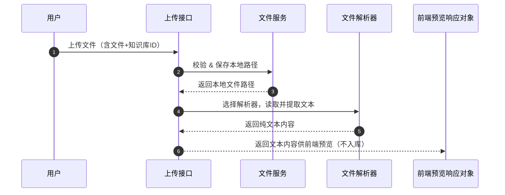
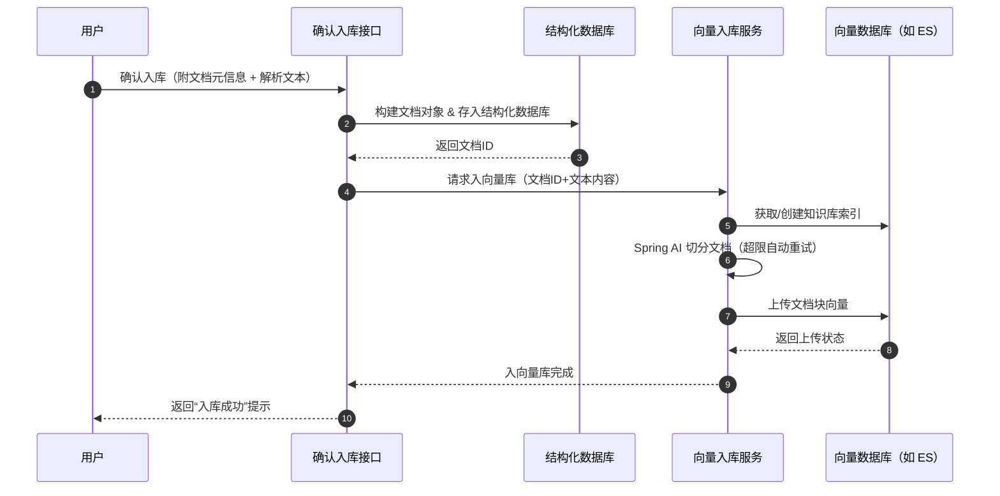
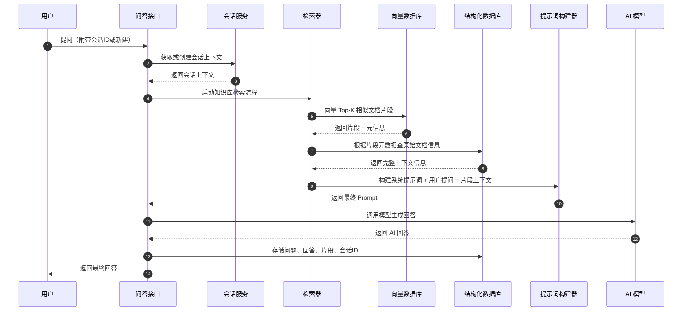
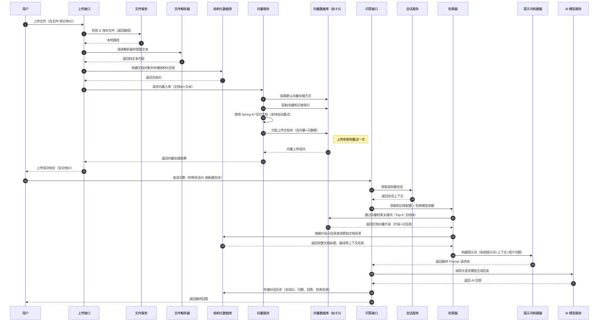

# 后端相关逻辑梳理

### 1. 文件上传流程

**1.1 上传阶段：**

- 接收文件上传请求
- 获取当前用户信息
- 验证知识库（当前为唯一知识库，暂不校验）
- 权限验证（略，因知识库唯一）
- 生成文件存储路径
- 文件合法性校验（大小、格式等）
- 上传文件至服务器本地指定目录

**1.2 解析阶段：**

- 读取本地文件
- 根据文件扩展名选择对应的解析器（或使用默认解析器）
- 提取文本内容
- 返回结构化解析结果

------

### 2. 知识库入库流程

**2.1 文档生成与结构化入库：**

- 获取当前用户
- 将解析后的文本内容构建为文档对象
- 存入结构化数据库（用于管理与检索）

**2.2 向量库准备：**

- 获取默认向量存储方式（如 Elasticsearch）
- 获取唯一绑定的向量知识库
- 获取/创建向量索引
- 构建向量元数据信息（与结构化数据库部分信息重叠）

**2.3 文档切分与向量入库：**

- 使用 `Spring AI Document` 进行内容切分（超过限制时自动重试切分）
- 分块上传文档至向量库
- 失败块支持一次重试机制

------

### 3. AI 检索与对话流程

**3.1 会话管理：**

- 判断是否存在会话 ID
- 创建新会话或继续历史会话
- 设置默认或自定义会话标题
- 处理用户提问并记录聊天历史

**3.2 检索准备：**

- 获取当前使用的聊天模型（固定）
- 获取对应的向量库（当前使用 ES）
- 设置模型参数（如温度、topK 等）
- 通过关键词检索获取向量库匹配文档片段
- 从结构化数据库中查找文档的原始信息

**3.3 构建 AI 请求并响应：**

- 基于检索到的 Top-K 文档片段，构建提示词：
  - 包括系统提示词模板、用户提问、文档上下文
- 生成最终请求
- AI 模型返回响应结果（模型支持 Rerank 时可加权优化文档排序）

# Dify使用商讨

| 对比维度     | Dify API 调用                                                | Spring AI                                                    | 关键差异与影响                                |
| ------------ | ------------------------------------------------------------ | ------------------------------------------------------------ | --------------------------------------------- |
| 核心定位     | AI 应用平台/智能网关                                         | AI 模型集成框架                                              | Dify：上层应用能力 Spring AI：底层模型访问 |
| 性能延迟     | 较高（应用→Dify→LLM 多跳 + Dify处理开销）                    | 较低（应用→LLM 直接调用 + 轻量封装）                         | Spring AI 延迟低                              |
| 性能吞吐量   | 受限于 Dify 服务性能（需独立扩展）                           | 接近原生 SDK（依赖应用服务器资源）                           | Spring AI 吞吐量高                            |
| 服务资源占用 | ⚠️ 高资源消耗： • 需独立服务器部署（2核4G起） • 额外占用网络带宽（多跳转发） • 向量数据库等依赖组件消耗资源 | ✅ 低资源消耗： • 仅作为Jar包集成（<50MB内存） • 无额外网络转发 • 无强制外部依赖 | Spring AI 资源消耗降低 60-80%                 |
| 开发效率     | ✅ 复杂功能免开发（RAG/Agent/会话链）                         | ❌ 需自研高级功能（RAG调用，切片处理，提示词，MCP，Agent等）  | Dify 节省复杂功能开发成本                     |
| 配置管理     | ✅ 动态集中配置（在线生效）                                   | ⚠️ 需重启/刷新配置                                            | Dify 适合高频迭代场景                         |
| 运维复杂度   | ⚠️ 高： • 需维护Dify • 监控向量数据库等组件             | ✅ 低： • 无额外服务 • 集成到现有监控体系               | Spring AI 运维成本降低 70%                    |
| 扩展性影响   | • 水平扩展需扩容Dify集群 • 增加架构复杂性                 | • 随应用集群自动扩展 • 无状态设计简单                     | Spring AI 扩展更平滑                          |
| 冷启动资源   | 需预分配Dify固定资源（即使无请求）                           | 按需加载（无请求时零占用）                                   | Spring AI 更适合波动负载场景                  |
| 适用场景     | 复杂AI应用/动态配置需求                                      | 基础调用/超低延迟/资源敏感场景                               | 资源紧张必选Spring AI                         |

上述逻辑梳理流程中使用为不包含Dify，目前需要取决**开发成本和资源成本**取舍，**该对比仅为是否使用Dify，不作为其它资源占用对比**(Ollam模型，向量数据库，结构化数据库)

### 资源消耗对比

| 资源类型   | Dify API 调用                                             | Spring AI                                                    | 节省建议                   |
| ---------- | --------------------------------------------------------- | ------------------------------------------------------------ | -------------------------- |
| 计算资源   | • 独立部署：2核4G 最低要求 • 每节点并发50请求需4核8G   | • 集成到应用：共享资源 • 额外内存<50MB/实例               | Spring AI 节省 1-2台服务器 |
| 内存消耗   | • 基础服务：1.5GB+ • 向量检索模块：500MB+              | • 框架本身：<30MB • 无新增常驻进程                        | Spring AI 内存占用减少 98% |
| 网络带宽   | • 双倍消耗（输入输出各经Dify中转）                        | • 直连LLM服务（单跳传输）                                    | 减少 50% 网络传输成本      |
| 存储依赖   | • 必须：PostgreSQL+Redis • 可选：Milvus/Qdrant等向量库 | • 无强制存储依赖 • 可选集成现有存储 • 仍需要向量数据库支持  | 消除 更多中间件维护        |
| 连接池消耗 | • 维护两套连接池：   App→Dify + Dify→LLM               | • 单连接池：App→LLM                                          | 减少 50% 连接管理开销      |
