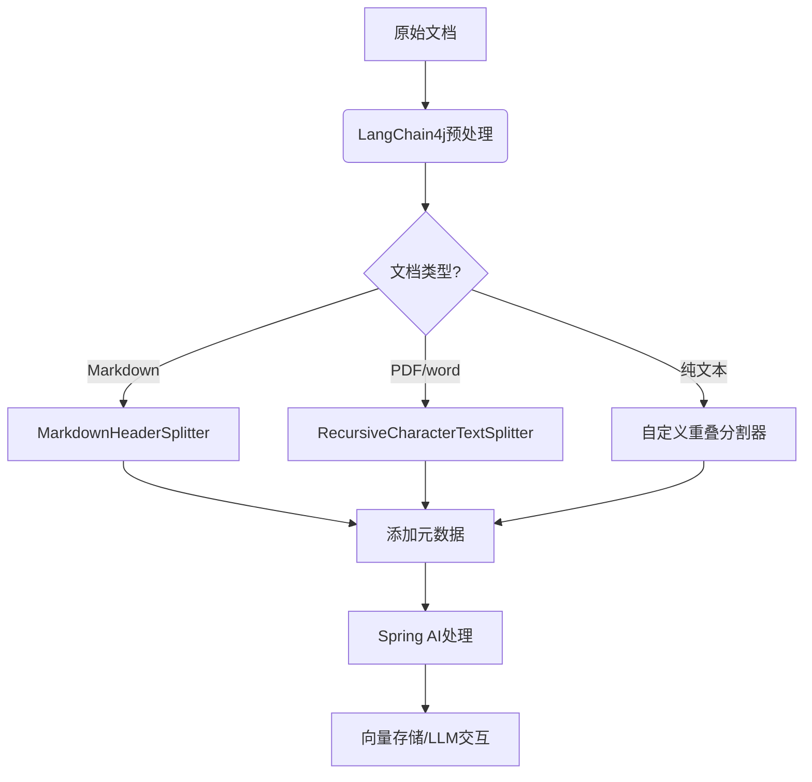
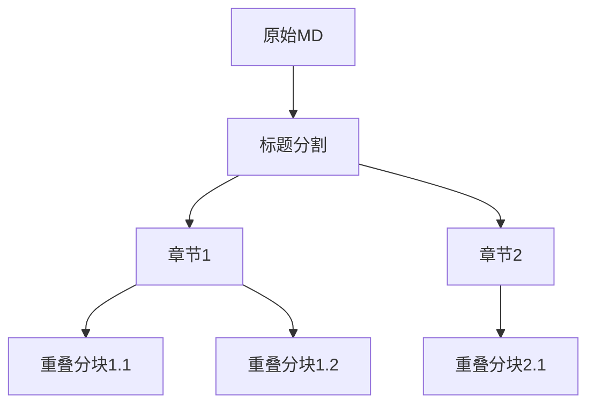
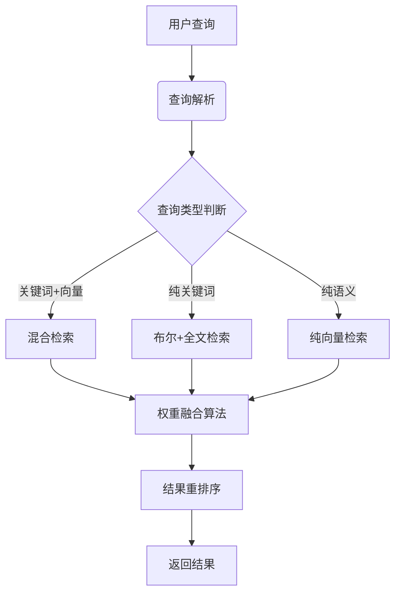
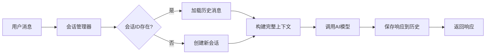
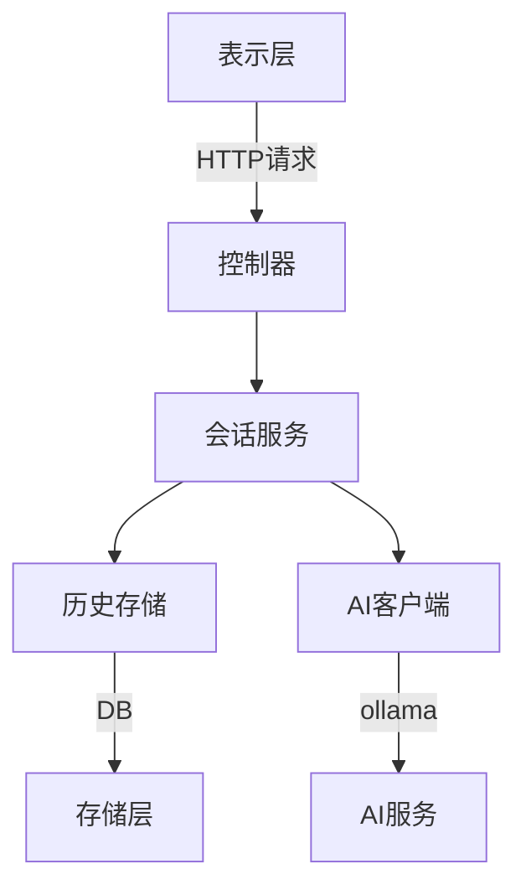
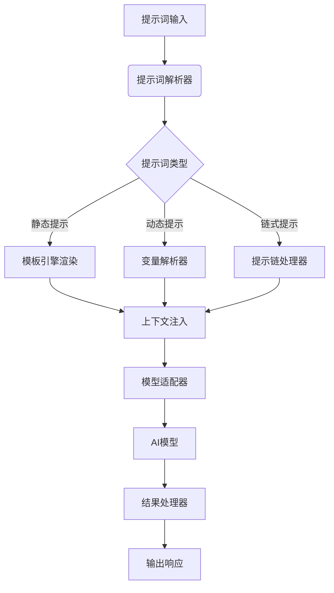

### RAG流程改动分析⬇️

上传知识 → **调用 AI 总结精简内容** → 上传精简内容到一个新知识库（如“知识库2”）→ 对精简内容进行索引与检索->对原知识库检索

 **优点分析：为什么这样可能更好？**

原始内容可能包含很多冗余、无用、重复内容（如说明文字、格式语、示例等），AI 总结后往往更“语义密集”，可以：减少向量维度中的噪声

AI 总结往往能提炼出关键信息点，使用这些信息点做向量索引，在用户提问时更容易匹配上“重点内容”，特别适合：

- **复杂长文档**
- **结构混乱或语言啰嗦的文本**

 **缺点分析：为什么这样可能不合适？**

##### 1. **信息丢失风险**

AI 总结本质上是「压缩」，必然会 **丢失一些边缘信息或上下文**，这可能导致：

- 某些具体问句检索不到答案
- 用户问了“细节性问题”时召回失败

特别是当用户的提问点，恰好 **不在摘要中**，效果会更差。

##### 2. **AI 总结质量不稳定**

AI 生成的摘要有时会：

- **误删关键信息**
- **抽象得过头**
- **引入理解偏差**

尤其在**专业领域内容**（如法律、医学、技术规范，政策）中，这种偏差放大影响效果。

##### 3. **增加预处理成本**

- 每个文档都需要 AI 总结，增加了预处理时间和成本
- 若使用外部大模型，还会涉及调用费用

### **联网搜索功能分析**(5)⬇️

##### **方案一：使用 Spring AI 的 `WebClient` + HTML 解析 (轻量级抓取)**

优点： 无需第三方 API，适合单个固定网站的结构化抓取

缺点：反爬虫风险（需处理 User-Agent、IP 轮换等），动态内容（如 JavaScript 渲染）无法直接获取，维护成本高（网站结构变化需调整代码）

##### 方案二**使用搜索引擎 API**

Google Custom Search JSON API （暂不考虑，需解决国内代理问题）

tavily 使用人数较多 每月1000免费次数(官网建议个人使用)，$30/月  4000次

serp 评价较好，$50/半年 50000次

##### **方案三：向量数据库 + Web 爬虫**

1. 用 **Apache Nutch**/**Scrapy** 定时抓取目标网站。
2. 将抓取内容存入 **向量数据库**（Chroma, Milvus, Elasticsearch）。
3. 通过 Spring AI 的 `VectorStore` 接口进行语义检索。

 架构复杂（需维护爬虫、ETL、数据库）

综合考虑，serpAPI是平衡成本和效率的一种选择，自建模型在无付费下实现较复杂，开发成本也比较复杂

### RAG文档切分相关（1）⬇️

#####  **问题分析**

- **Spring AI TokenTextSplitter限制**：
  - 无重叠区块设置（无上下文连续性）
  - 仅按token计数分割（忽略文档结构）
  - 不支持层级内容（如Markdown标题、PDF章节）
- **LangChain4j优势**：
  - 提供`DocumentTransformers`支持重叠分割
  - 内置`RecursiveCharacterTextSplitter`等层级感知分割器
  - 支持Markdown/HTML等结构化解析

##### 整合方案设计

同时，针对需要层级切分的情况，需要进行测试token/和层级切分的效果，因为层级切分是不支持覆盖率设置的

层级结构示意图

### ES混合检索(2)⬇️

针对 Elasticsearch (ES) 存储的向量库实现混合检索（结合元数据、文本内容和向量相似度），需要设计数据模型、索引结构和查询策略。

1. **分层数据模型** - 保留文档结构和元数据
2. **动态权重融合** - 平衡关键词与语义搜索
3. **智能重排序** - 结合业务规则优化结果
4. **缓存优化** - 提升高频查询性能（占用内存可能加大，暂不考虑）

### 多轮对话(4)⬇️

在Spring AI中实现会话的聊天历史功能包括：

1. 使用`ChatClient`发送包含历史记录的`Prompt`。
2. 维护每个会话的消息列表。
3. 在存储中保存会话历史（内存、Redis、数据库等）。
4. 处理历史记录长度，避免超出模型的token限制。

##### 分层架构设计

历史会话可能会导致模型用户输入被进一步压缩，响应加长

针对复杂场景在后续可以考虑使用**`VectorStoreChatMemoryAdvisor`**

使用向量数据库来存储和检索历史对话，基于用户反馈存入或删除

### Spring AI 提示词设计(3)⬇️

提示词类型规范：

