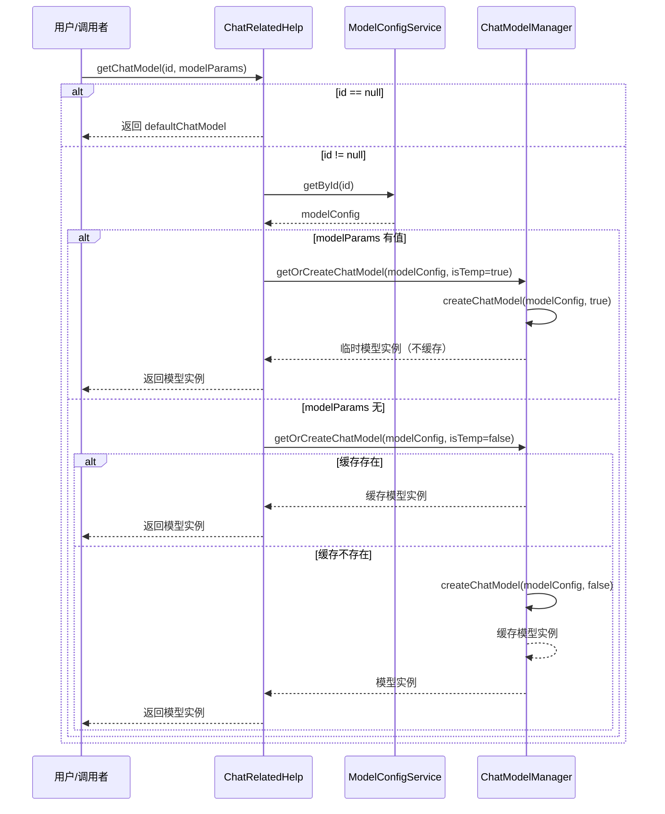
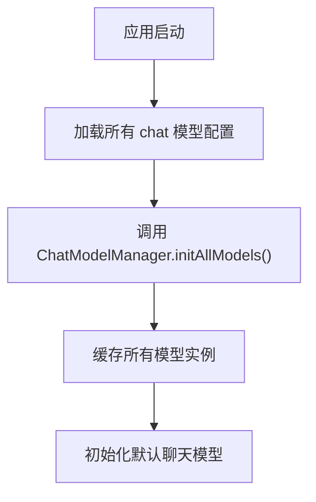
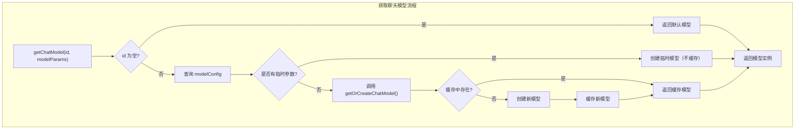
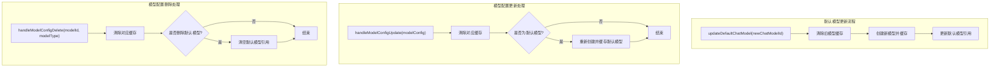

# 模型切换变更

## 1.数据库表变更

```sql
ALTER TABLE t_model_config
ADD COLUMN model_parameters json NULL COMMENT '模型参数(JSON Map 序列化结果)';
```

- 模型配置表增加字段，可能不同模型参数不尽相同，使用json格式
- 该字段做为模型加载时默认配置，参考配置示例

```
{"topK": 30, "topP": 0.9, "temperature": 0.7}
```

## 2.接口变更

### 会话请求接口


- 新增参数 modelId  可指定不同模型
- 新增参数modelParams 可指定模型参数
- 默认两者均可不指定，modelParams仅在指定模型后生效

### 模型配置相关接口


- 模型配置接口已更新字段，更新配置后会清除缓存，再次使用该id会重新从库中加载

## 3流程逻辑

### 1. 模型初始化（启动时）

- 应用启动时，`ChatRelatedHelp`的`run()`方法触发：
  - 从数据库加载所有`chat`类型的模型配置列表；
  - 调用`ChatModelManager.initAllModels()`批量创建并缓存所有模型实例；
  - 读取平台设置中的默认模型ID，调用`initializeDefaultChatModel()`初始化默认聊天模型实例并缓存。

### 2. 获取聊天模型

- 调用`ChatRelatedHelp.getChatModel(Long id, String modelParams)`获取指定模型：
  - 若传入`id`为空，返回默认聊天模型；
  - 否则根据`id`查询模型配置，判断是否传入临时参数`modelParams`：
    - 若有临时参数，动态替换配置，创建临时模型实例，不缓存；
    - 否则调用`ChatModelManager.getOrCreateChatModel()`，缓存复用已有模型实例。

### 3. 创建聊天模型流程（`ChatModelManager.createChatModel()`）

- 校验`modelConfig`非空且类型为`chat`；
- 根据`modelConfig.getCategory()`选择具体模型构建方法：
  - `ollama`调用`createOllamaChatModel()`，解析参数，创建`OllamaChatModel`；
  - `openai`调用`createOpenAiChatModel()`，创建`OpenAiChatModel`；
  - `deepseek`调用`createDeepSeekChatModel()`，创建`DeepSeekChatModel`；
- 非临时模型会加入缓存，临时模型则不会缓存；
- 当前仅ollama模型使用模型参数，后续扩展其它模型需改动代码，但实现通用简单

### 4. 默认模型更新

- 调用`ChatRelatedHelp.updateDefaultChatModel(Long newChatModelId)`：
  - 获取新模型配置，清除旧模型缓存；
  - 创建新模型并缓存为默认模型；
  - 更新当前默认模型配置记录。

### 5. 模型配置变更处理

- `handleModelConfigUpdate(ModelConfig modelConfig)`：
  - 清除对应模型缓存；
  - 若更新的是当前默认模型，重新创建并缓存默认模型实例。
- `handleModelConfigDelete(Long modelId, String modelType)`：
  - 清除对应模型缓存；
  - 若删除的是当前默认模型，清空默认模型引用，需重新设置。









