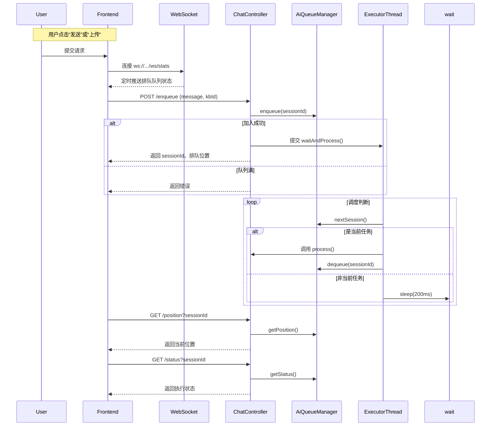
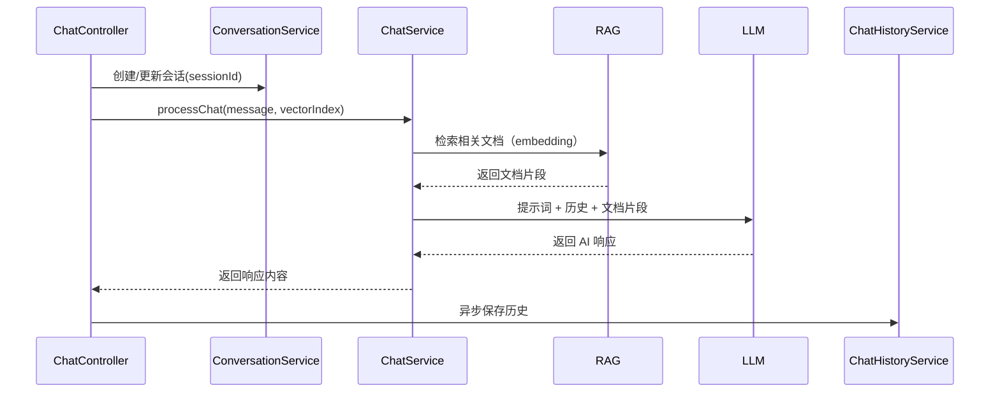

#####  一、问题本质剖析

| 问题点            | 具体表现                    | 风险                                    |
| ----------------- | --------------------------- | --------------------------------------- |
| 1. 大模型性能差   | 每个会话执行时间长（>2min） | 响应慢、服务不可用                      |
| 2. 并发压力不可控 | 多个对话并发调用大模型      | 服务器 CPU/GPU 爆满、线程阻塞、系统假死 |
| 3. 没有流量调度   | 请求一拥而上，没有排队      | 用户体验差，崩溃风险高                  |

#####  二、排队机制的核心目标

目标不是提升模型本身性能，而是构建一个**“有序、高可用、可观测”** 的访问机制：

核心目标如下：

| 目标     | 说明                                                 |
| -------- | ---------------------------------------------------- |
| 限流     | 控制同时进行的会话数量                               |
| 排队     | 超出并发限制的请求进入等待队列                       |
| 可观测性 | 提供实时排队信息：当前处理数、队列长度、预估等待时间 |
| 超时控制 | 超过排队等待时间的请求自动取消                       |
| 用户通知 | 明确提示用户是否正在排队、排第几位、是否被取消       |

#####  三、技术方案方向（宏观设计）

1. **引入异步请求与任务队列机制**

- 使用异步任务处理（Spring `@Async` / `WebFlux` / `**CompletableFuture**`）
- 核心：**请求先入队列，不直接执行模型调用**

2. **排队控制器 + 状态缓存**

- 请求到达 → 判断是否超过最大并发数
- 否 → 进入执行状态
- 是 → 入队，返回等待信息
- 可使用 Redis List / 队列库（如 Resilience4j）/ **BlockingQueue** 管理请求排队状态

3. 统一的会话调度管理器

- 控制当前最多同时运行的任务（如设置最多同时处理 2 个会话）
- 新请求在“会话槽”空出后自动启动执行
- 可使用 **信号量（Semaphore）** 控制并发任务

4. 后台**监控线程** + **WebSocket** 实时反馈用户排队信息

- 用户排队时，通过轮询或 WebSocket 接收更新（如排第几位、预计等待时间）
- 一旦**超时/取消/完成**，自动触发队列下一人

5. （❌）请求状态持久化（防止重启丢失）

- 暂不考虑，服务器宕机未完成对话丢弃

#####  四、整体架构图（抽象）

    ┌────────────────────────────┐
    │      用户请求 (REST API)    │
    └────────────┬───────────────┘
                 │
          ┌──────▼──────┐
          │ 会话接入控制器 │  ➜ 判断是否超并发
          └──────┬──────┘
                 │
    ┌────────────▼────────────┐
    │     会话调度器（排队模块） │
    ├──────────────────────────┤
    │ - 当前运行会话计数控制     │（Semaphore）
    │ - 排队队列管理             │（BlockingQueue）
    │ - 会话状态追踪             │（Map）
    └────────────┬────────────┘
                 │
           ┌─────▼──────┐
           │  模型执行器 │ ➜ 实际调用 Spring AI Chat 接口
           └────────────┘
                 │
           ┌─────▼──────┐
           │ 状态监听器 │ ➜ 通知排队者更新进度
           └────────────┘

五、体验优化

1. **前端实时反馈**：
   - 展示当前排队人数
   - 展示自己的排队位置
   - 动态提示「预计等待时间」
2. **用户可取消排队**
   - 后端支持任务取消机制，及时释放资源
3. （❌）**提供快捷通道**
   - 比如会员或优先用户可跳过队列（暂不考虑）