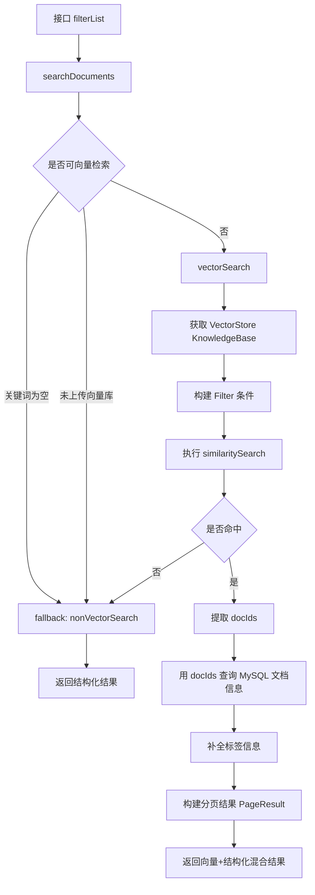

## ✅混合检索完整流程说明（结构化 + 向量检索）

### 🔹 接口入口：`/filterList`

```java
@GetMapping("/filterList")
public R<PageResult<DocumentSearchResponse>> searchDocuments(DocumentSearchRequest request)
```

### ✅ 第一步：主搜索逻辑分发（vector or non-vector）

```java
public PageResult<DocumentSearchResponse> searchDocuments(DocumentSearchRequest request)
```

#### 👇 内部核心分支逻辑：

| 条件                                | 进入搜索方法        |
| ----------------------------------- | ------------------- |
| `keyword` 为空                      | `nonVectorSearch()` |
| `request.getStatus()` ≠ `COMPLETED` | `nonVectorSearch()` |
| 其余情况（有关键词 + 已上传向量）   | `vectorSearch()`    |

------

## ✳️ 非向量检索：`nonVectorSearch()`

```java
// 直接从 MyBatis + MySQL 查结构化字段（标题、分类、标签、发布时间）
page = documentMapper.searchDocuments(page, request);
addTagsInfo(page.getRecords());
```

- 支持分页
- 标签信息通过 `selectTagsByDocumentIds()` 补充
- 常用于空关键词 / 不支持嵌入的情况

------

## 🔍 向量检索：`vectorSearch()`

### 核心流程：

1. 检查索引有效性（若知识库未建索引 → fallback）
2. 构建 filter 条件：如标签、时间范围、知识库索引名
3. 构造向量查询请求：
   - query: 用户 keyword
   - topK: 页大小
   - similarityThreshold: 相似度门限
   - filter: 结构化条件

```java
List<org.springframework.ai.document.Document> docs = vectorStore.similaritySearch(searchRequest);
```

1. 向量命中为空时 → fallback 到结构化检索
2. 命中有结果：
   - 提取向量命中的文档 ID
   - 通过 ID 反查 MySQL → 得到结构化数据 + 标签
   - 设置总数为向量命中的数量（用于分页）

------

## 🧩 Filter 条件构建（结构化 + 向量共同使用）

```java
Filter.Expression expression = buildFilterExpression(request, knowledgeBase)
```

支持的结构化条件：

| 字段         | 条件类型  |
| ------------ | --------- |
| index_name   | eq        |
| id 列表      | in        |
| tag_ids      | in        |
| publish_time | gte / lte |


最终通过 AND 拼接为一个 Filter.Expression，用于：

- 向量检索过滤
- 查询结构化文档时使用 `request.setIds(ids)`

------

## 📊 Mermaid 流程图：混合检索主流程



------

## 🧠 总结：混合检索的价值

| 能力点             | 实现方式                                      |
| ------------------ | --------------------------------------------- |
| 用户关键词匹配     | `vectorStore.similaritySearch()` → 语义理解   |
| 精准结构化过滤     | `Filter.ExpressionBuilder` → 标签、时间、索引 |
| 不命中自动降级     | fallback 到 `nonVectorSearch()`               |
| 结果补全（如标签） | 通过 `addTagsInfo()` 补全                     |
| 支持分页 / 排序等  | 结合向量库 + MySQL 查询处理                   |