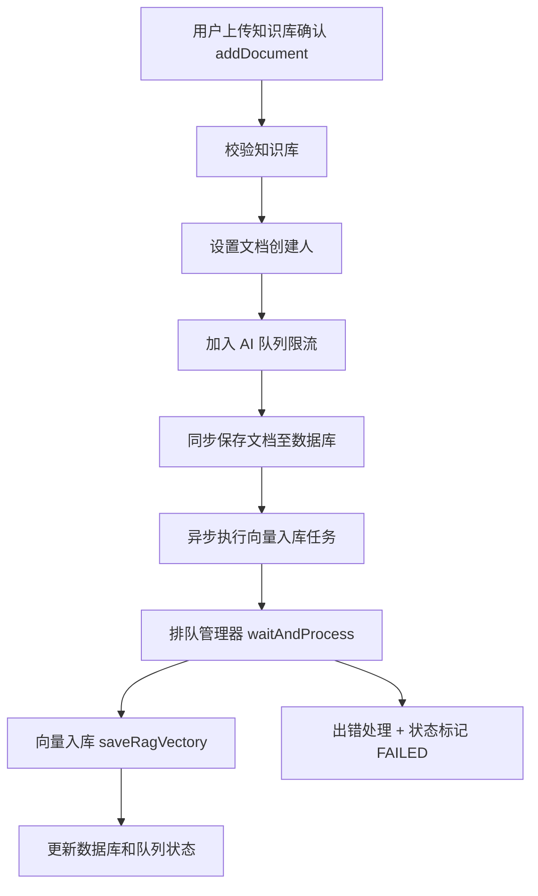
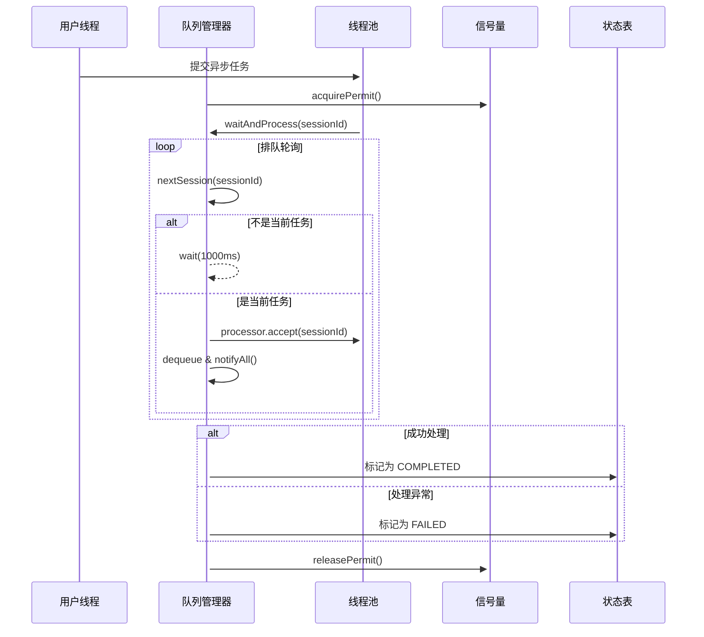
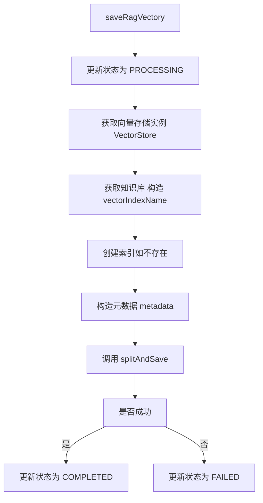
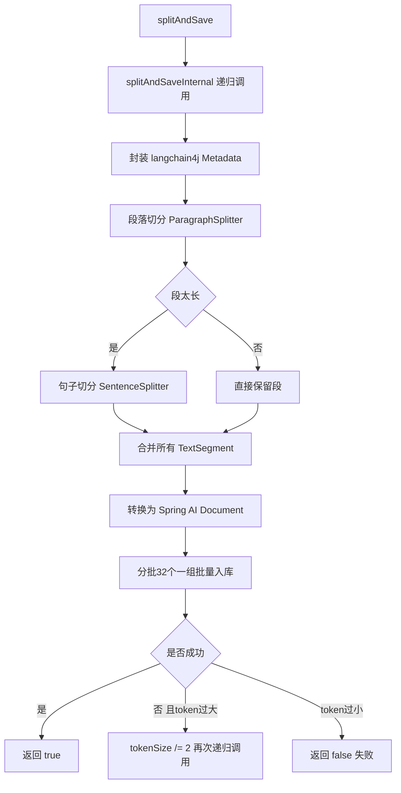
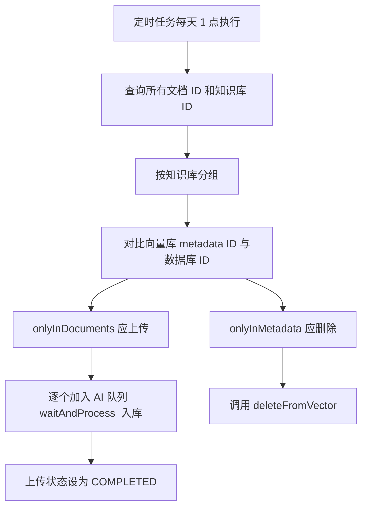

## ✅ 知识库文档上传完整流程（从 Controller 到向量库）

#### 一、接口入口：`addDocument()`

**步骤明细：**

1. **校验知识库是否存在**
2. **设置文档创建人/更新人**
3. **加入 AI 处理队列（限流）**
4. **同步存储到数据库（保存基本信息）**
5. **异步入向量库（调用线程池执行）**
6. **返回排队结果信息**

#### 二、AI 排队处理器：`waitAndProcess()`

控制大模型调用的**并发量**，通过**排队 + permit 限流**，确保同时处理任务不超限，并实现**任务顺序、公平性和状态管理**。

**💡 核心流程详解：**

**1️⃣ 获取执行权（限**流控制）：

```
acquirePermit(); // 使用 Semaphore
```

- 控制同一时刻允许的并发数（如只允许 2 个任务同时执行）

2️⃣ 进入循环等待处理机会

- `nextSession(sessionId)`：轮询判断当前处理序列是否轮到本任务

- 如果不是当前 session，线程 sleep 等待 1 秒：

  ```
  synchronized (this) {
      this.wait(1000);
  }
  ```

3️⃣ 轮到当前任务时：

```
if (session.equals(sessionId)) {
    processor.accept(sessionId);
    synchronized (this) {
        this.notifyAll(); // 通知其他等待线程
    }
    dequeue(sessionId);  // 从队列中移除
}
```

- 调用 `processor.accept(sessionId)`：这就是函数接口传进来的逻辑（保存向量）
- 使用 `synchronized+notifyAll()` 唤醒其他线程继续判断是否轮到它们
- `dequeue(sessionId)`：正式出队，清理记录

4️⃣ 错误处理：

```
java复制编辑catch (Exception e) {
    log.error(...);
    requestQueue.remove(sessionId); // 从队列清除
    sessionStatusMap.put(sessionId, FAILED);
}
```

- 错误情况下设置状态为 `FAILED`
- 移除队列 & 清理时间戳记录

5️⃣ 最终释放 permit：

```
java复制编辑finally {
    releasePermit(); // 无论成功失败都释放 permit，避免死锁
}
```

####  三、向量入库核心逻辑 `saveRagVectory()`

1. 更新数据库上传状态(值与队列相同)
2. 获取向量存储实例，获取知识库，并处理索引
3. 准备元数据（metadata）
   - `id`、`title`、`knowledge_base_id`、`tag_ids`、`file_name`、`file_path` 等
4. 分段切分并保存：使用 `RecursiveStructureSplitUtil.splitAndSave()`
5. 更新状态为 COMPLETED / FAILED（根据是否成功）

| 能力         | 实现方式                        |
| ------------ | ------------------------------- |
| 异步执行     | 使用线程池+排队机制             |
| 限流         | `acquirePermit()` 控制并发      |
| 切分优化     | 递归式 token 降级切分           |
| 入库健壮性   | 批量入库 + 自动重试             |
| 状态追踪     | `SessionStatus` 管理阶段状态    |
| 元数据结构化 | `metadata` 统一传入每块向量文档 |

#### **四、核心入向量逻辑**：`saveDocumentToVectorStore()`

**详细过程：**

1. **获取向量存储对象 `VectorStore`**
2. **确认知识库存在，获取或创建 `vectorIndexName`**
3. **调用 `vectorStoreManager.createIndexIfNotExists()` 创建索引（如不存在）**
4. **准备元数据（metadata）**
   - `id`、`title`、`knowledge_base_id`、`tag_ids`、`file_name`、`file_path` 等
5. **分段切分并保存：使用 `RecursiveStructureSplitUtil.splitAndSave()`**
6. **更新状态为 COMPLETED / FAILED（根据是否成功）**

#### 五、文档切分与重试机制详  `splitAndSave()`

**大段文本内容切分为多个小块（chunk）**，每个 chunk 都具备以下特点：

- token 不超过模型嵌入限制（例如 OpenAI 通常 ≤ 512 或 1024）
- 携带完整的元数据，便于向量库索引、过滤、删除
- 切分失败时自动降级 retry

1️⃣ `splitAndSaveInternal()`：递归分块处理核心逻辑

- 元数据封装,使用langchain4j的Metadata，方便后续文章处理
- 兼容性调整，langchain4j不支持列表对象，需处理序列化和反序列化
- 使用段落切分器按 token 切段：
  - 每段限制 token ≤ `currentTokenSize`
  - 如果段很长，会尝试**在段落边界**进行切分
  - `overlap`（交叠 token）用于保持语义连续性
- 对超长段落做句子级再切分（降级处理）
  - 如果段落仍然太长（远超  token），说明内容结构太紧密
  - 使用句子粒度进一步细化,解决“长段内容无换行/无标点”的问题
-  构建 Spring AI 文档对象（转换为可入向量库库形式）
- 批量入库，最多支持32个块为一个batch，进行批量入向量库
  - 每个 `Document` 会被转换为向量（Embedding）
- 失败自动重试（递归降级 token size）
  - 若写入失败（如超 token 限制、分块失败）将 token size 减半，重新切分并尝试，最小阈值防止死循环

| 目标             | 实现手段               |
| ---------------- | ---------------------- |
| 控制嵌入长度     | token 限制机制         |
| 保持语义完整     | 段落优先，句子次之     |
| 自动适应文档结构 | 递归降级切分           |
| 提高成功率       | 批处理 + 重试          |
| 附带可追踪信息   | chunkIndex、元数据字段 |

#### 六、定时任务同步机制：`syncUploadVector()`

**功能：每天凌晨 1 点对比并同步**

1. **从数据库读取所有文档的 ID & 知识库 ID（不查内容）**
2. **按知识库分组**
3. **比较向量库中的 metadata 与数据库 document 的差集**：
   - `onlyInDocuments` → 应该上传的（漏上传）
   - `onlyInMetadata` → 应该删除的（文档已删除）
4. **批量上传缺失文档（加入 AI 队列）**
5. **批量删除无效元数据文档（`deleteFromVector()`）**
6. **批量更新已经存在知识库文档的上传状态**

#### 整体上传流程图



#### 通用AI 排队控制器时序图



#### 向量入库流程图



#### 文档切分与重试机制流程图



#### 定时任务：`syncUploadVector()` 对比同步流程



